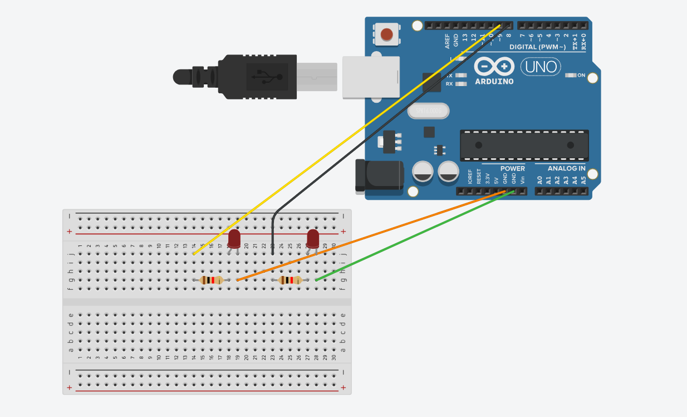

# Color Detection and LED Control Using OpenCV and Arduino


This project uses a video input to identify colors, and then it uses that information to turn on an LED on the Arduino board. It demonstrates the merging of computer vision and hardware control, and it demonstrates how to utilize OpenCV for color detection as well as build and deliver data in a serial connection between the Python script and Arduino board.

## Project Components

The project consists of the following components:

1. **`main.py`**: The core code for recording video, detecting colors, and activating the LED in response to those colors is contained in this file.

2. **`arduino_code.ino`**: The code in this file allows the Arduino board to operate the LED by receiving signals from the Python code.

## Software Requirements
- Python 3.7+
- OpenCV library
- PySerial library

## Physical Requirements
- Arduino board
- Breadboard
- 2x LEDs
- 4x jumper cables
- 2x 220 ohm resistors

## Arduino Setup


1. Connect the breadboard and LEDs to the Arduino just as shown in the image

2. Upload the **`arduino_code.ino`** file to the Arduino board using the Arduino IDE.

## Usage
1. Clone or download this repository to your local machine.

2. Create a virtual envoirment (optional but recommended):
```
Linux
$ python3 -m venv env
$ source env/bin/activate

Windows
> python -m venv env
> env\scripts\activate
```

3. Install the required libraries using pip:
```
$ pip install -r requirements.txt
```

4. Run the **`main.py`** script:
```
$ python3 ./main.py
```

5. Three distinct windows will open, one displays the input in its raw form and the other the input in its color-masked form.

6. The LEDs will toggle based on the detected color.

## Code Overview

### main.py
```python
import cv2
import numpy as np
import serial

# Initialize the video capture device
cap = cv2.VideoCapture(0)

# Initialize the serial port for communication with the Arduino board
ser = serial.Serial('COM4', 9600)

# Define the color ranges for the desired colors (e.g., red and green)
red_lower = np.array([0, 100, 100])
red_upper = np.array([10, 255, 255])

green_lower = np.array([35, 50, 50])
green_upper = np.array([85, 255, 255])

# Main loop
while 1:
    # Read a frame from the video capture device
    ret, frame = cap.read()

    # Convert the frame to the HSV color space
    into_hsv = cv2.cvtColor(frame, cv2.COLOR_BGR2HSV)

    # Create masks for the desired colors
    red_mask = cv2.inRange(into_hsv, red_lower, red_upper)
    green_mask = cv2.inRange(into_hsv, green_lower, green_upper)

    # Count the number of pixels for each color
    red_count = cv2.countNonZero(red_mask)
    green_count = cv2.countNonZero(green_mask)

    # Send signals to the Arduino board based on the detected colors
    if red_count > 1000:
        ser.write(b'R')
        print("Red color detected!")
    elif green_count > 1000:
        ser.write(b'G')
        print("Green color detected!")
    else:
        ser.write(b'E')

    # Display the frame
    cv2.imshow('Original', frame)

    # Exit the loop if the user presses 'Esc'
    if cv2.waitKey(1) == 27:
        break

# Release the video capture device and close the window
cap.release()
cv2.destroyAllWindows()
```

### arduino_code.ino

```arduino
void setup() {
  // Initialize the LEDs
  pinMode(8, OUTPUT);
  pinMode(9, OUTPUT);

  // Initialize the serial communication
  Serial.begin(9600);
}

void loop() {
  // Check if there is data available on the serial port
  if (Serial.available()) {
    // Read the incoming data
    char receivedChar = Serial.read();

    // Control the LED based on the incoming data
    if (receivedChar == 'R') {
      digitalWrite(8, LOW);
      digitalWrite(9, HIGH);
    } else if (receivedChar == 'G') {
      digitalWrite(8, HIGH);
      digitalWrite(9, LOW);
    } else {
      digitalWrite(8, LOW);
      digitalWrite(9, LOW);
    }
  }
}
```

The video capture device is initialized and the frame is processed to detect colors by the **`main.py`** file. The Python code sends signals to the Arduino board, which uses the signals to operate the LEDs according to the colors it detects.

## Operation
1. The **`arduino_code.ino`** initializes a serial connection between the Arduino board and the local machine.
```arduino
Serial.begin(9600);
```

2. The **`main.py`** connects to the serial connection with the specified `PORT` and `baudrate`.
```python
ser = serial.Serial('COM4', 9600)
```

3. There are different variables for the lower and upper values of the desired colors.

4. A frame from the video feed is captured inside the main loop, and OpenCV is used to produce masks for the necessary colors.

5. A byte of data is sent across the serial connection if there are more than a thousand pixels that are the same color.

6. The LED is controlled by the Arduino board, which reads this byte data.
```arduino
char receivedChar = Serial.read();

if (receivedChar == 'R') {
  // Activate the red, deactivate the green LED...
} else if (receivedChar == 'G') {
  // Do the exact opposite...
} else {
  // Deactivate both...
}
```

## Customization

Please feel free to alter the project to meet your needs. To build a more intricate interactive system, you can change the color ranges for the required colors, increase the motion range of the LED, or incorporate other hardware.

## Showcase

You can experiment with color detection and hardware control, learn a lot about computer vision, hardware integration, and human-computer interaction, and expand your knowledge in these areas by using the code and instructions that are provided.